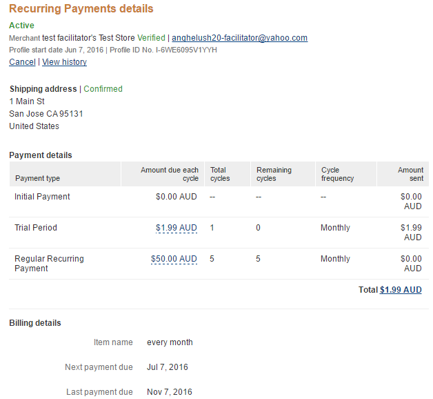

# FAQs



###Q. How can I set a trial of 0.99$ for one-week?
 
**A.** In order to set a trial for one week, the setup should look like this:
* Trial Amount: **0.99** ;
* Recurring Trial Billing Period: **Week** ;
* Recurring Trial Billing Frequency: **1** ;
* Recurring Trial Billing Cycles: **1**.

###Q. Is there any way to make sure that the trial and recurring payment settings are sent correctly to PayPal?

**A.** Yes, you can check this using PayPal Sandbox. After you click the "Pay" button and you'll be redirected to PayPal website, you can pay using a Sandbox account. After this, you can log-in to sandbox.paypal.com using the same account, then you can go to History - Basic Search. A recurring payment should look like this:

