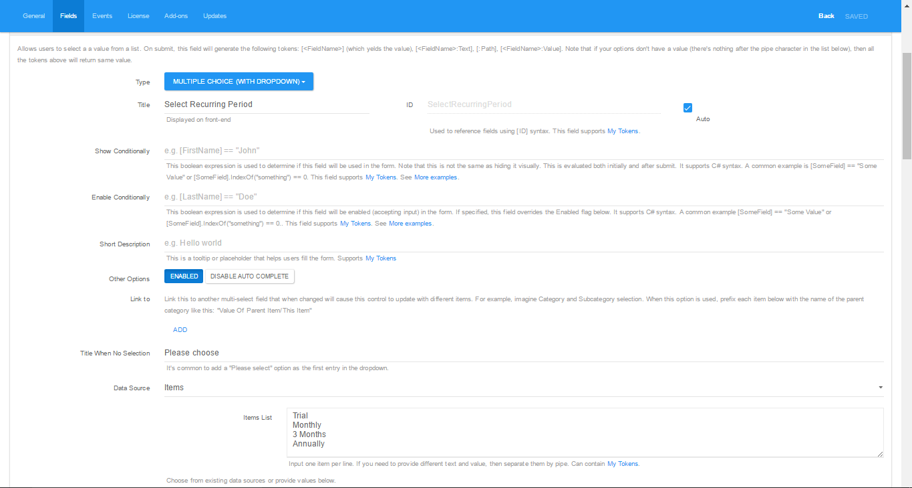
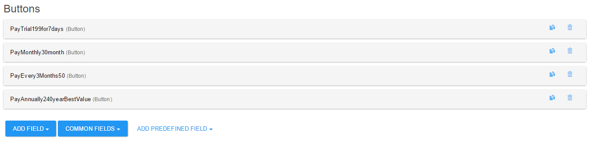
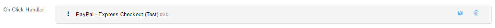
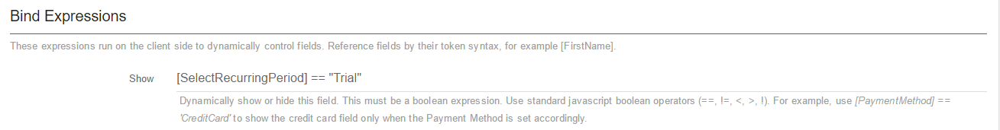
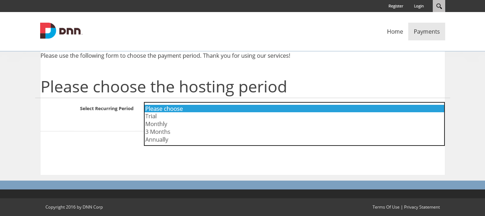
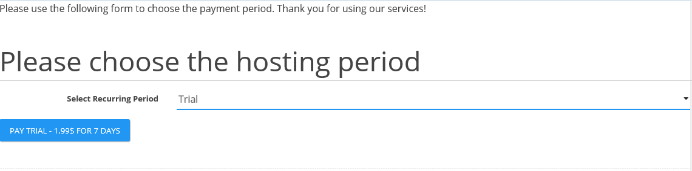

# FAQs



###Q. How can I set a trial of 0.99$ for one-week?
 
**A.** In order to set a trial for one week, the setup should look like this:
* Trial Amount: **0.99** ;
* Recurring Trial Billing Period: **Week** ;
* Recurring Trial Billing Frequency: **1** ;
* Recurring Trial Billing Cycles: **1**.

###Q. Is there any way to make sure that the trial and recurring payment settings are sent correctly to PayPal?

**A.** Yes, you can check this using PayPal Sandbox. After you click the "Pay" button and you'll be redirected to PayPal website, you can pay using a Sandbox account. After this, you can log-in to sandbox.paypal.com using the same account, then you can go to History - Basic Search. A recurring payment should look like this:

###Q. Is there any way to offer my clients multiple recurring periods in a drop-down?
**A.** Yes, definitely. In order to achieve this, please follow this tutorial:
1. Create an action form module;
2. Add a **"Multiple Choice (with Dropdown)"** field;
3. On the **DataSource**, select **"Items"** and add the desired in the **"Items List"** so it would look like this:

4. Now create a button for each item in the dropdown (**Add Fields - Buttons - Button**);

5. On each button we will create an "**On Click Handler**" with "**PayPal - Express Checkout**" action and configure the desire type of payment;

6. Now we need to link the buttons to the dropdown items. For this, we will go on each button, on parameter "**Show**" from the "**Bind expressions**" and a token like this one: **[SelectRecurringPeriod] == "Trial"**

The first part of the token, **[SelectRecurringPeriod]** is the ID of the dropdown field, and on the second part ("**Trial**") will be item from the dropdown.

At the end, it will look like this:

And when an item for the dropdown is selected, the button will be displayed:

