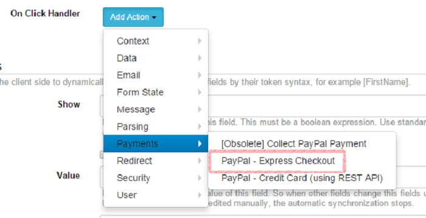
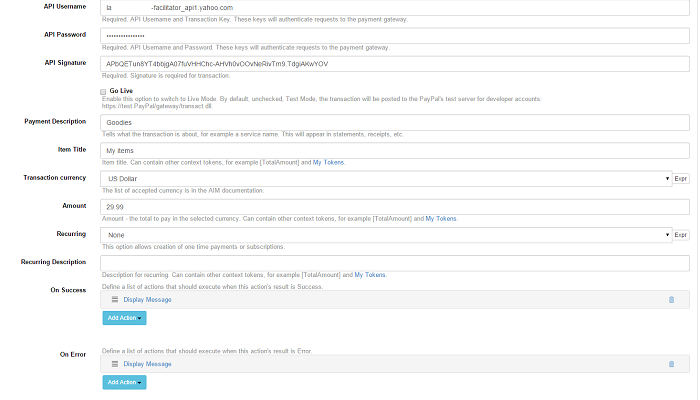
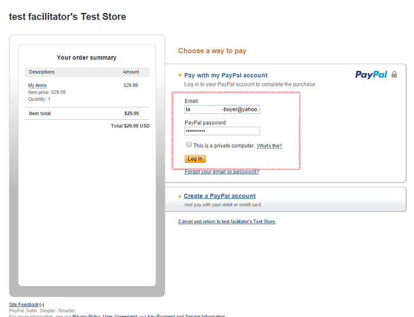
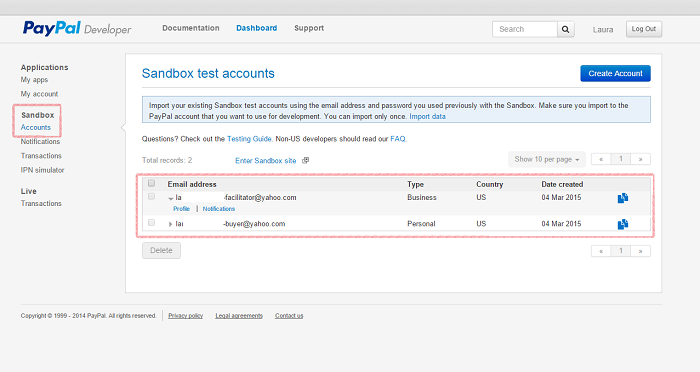
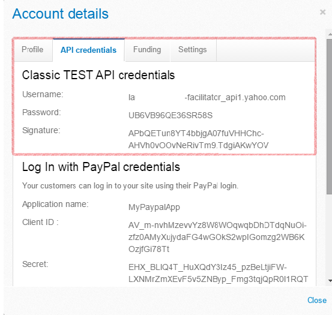
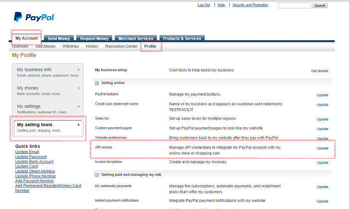
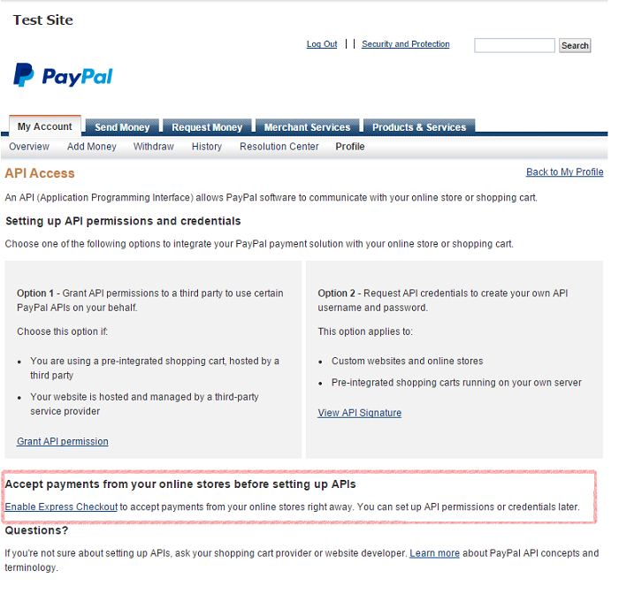
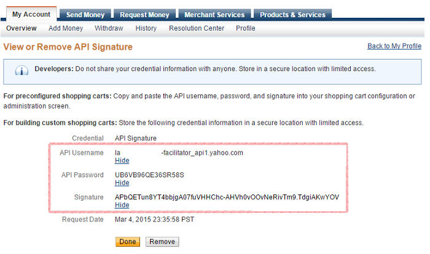
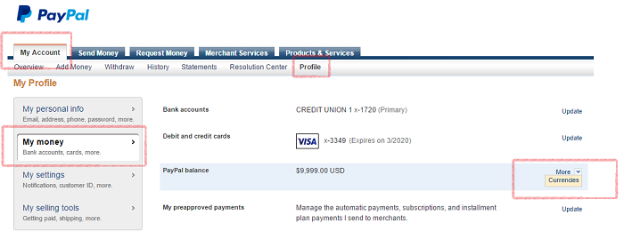
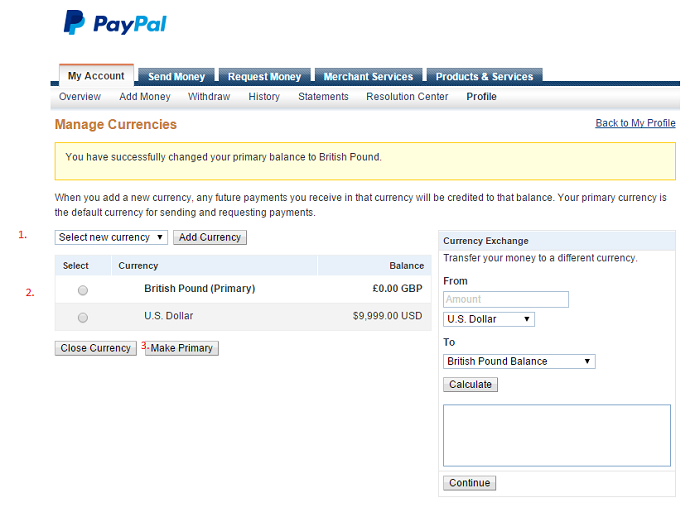

# PayPal - Express Checkout

**Breaking Changes** Increased minimum requirements to .NET 4.5 ** ** 

Express Checkout is a fast, easy way for buyers to pay with PayPal. Express Checkout eliminates one of the major causes of checkout abandonment by giving buyers all the transaction details at once, including order details, shipping options, insurance choices, and tax totals. 

**Configuration** 

Start by adding a new form on the page and select the blank template. Add the fields of your choice and a button. As On Click Handler action add Make a payment with PayPal Express.  

Click on the handler and proceed with the configuration.  

After you add the desired text fields, add a button. For On Click Handler select as action PayPal - Express Checkout. 

Click on Express Checkout and proceed to fill in all the fields: 

In our experience, using US Dollar for currency is guaranteed to work - however, if you'd like to use some other currency, check the Settings in case you need to do any adjustments.* The fields' labels are self-explanatory, and make sure you fill them all in. 

When you click on the button and the transaction is successful, you should be redirected to this page: 

This is where you log in with your buyer test account. 

**Accounts** 

For testing purposes, you have to set up a test account. Go to , log in with your PayPal developer account, then  navigate to Dashboard > Sandbox > Accounts.

  

You can find your test credentials by clicking on the Profile link under your facilitator email address (pictured above). You will need the following pieces of information: API Username, API Password, and API Signature.

  

Next up, make sure that Enable Express Checkout is on. You can do this by logging to

 with your facilitator account. Go to My Account > Profile > My Selling Tools > API Access, as illustrated below: 

  

Click on the Update button and you will land on this page:

Click on Express Checkout and enable it if it's not.

For business purposes, the credentials can be found by navigating to My Account > Profile > My Selling Tools > API Access (illustrated previously) and clicking on View API Signature (Option 2).

  

*

If you would like to change your primary currency, log in to your PayPal account, click on Profile, select My Money and click on Currencies:

  

Next up, add the currency of your choice, select it from the list, then click on "Make Primary." That's it, you can now safely select other currencies for your form.

  
